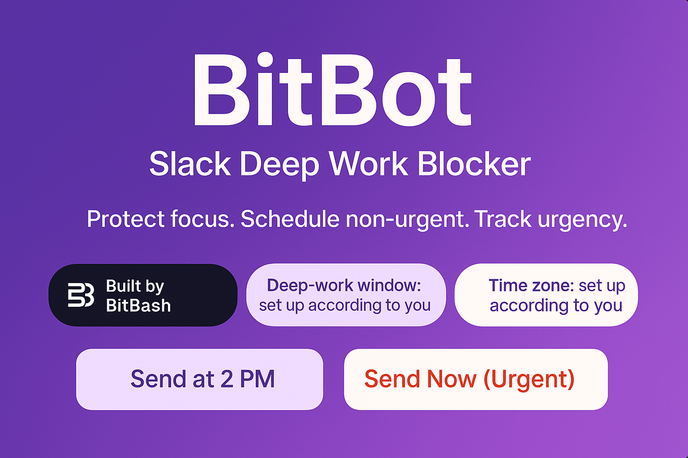
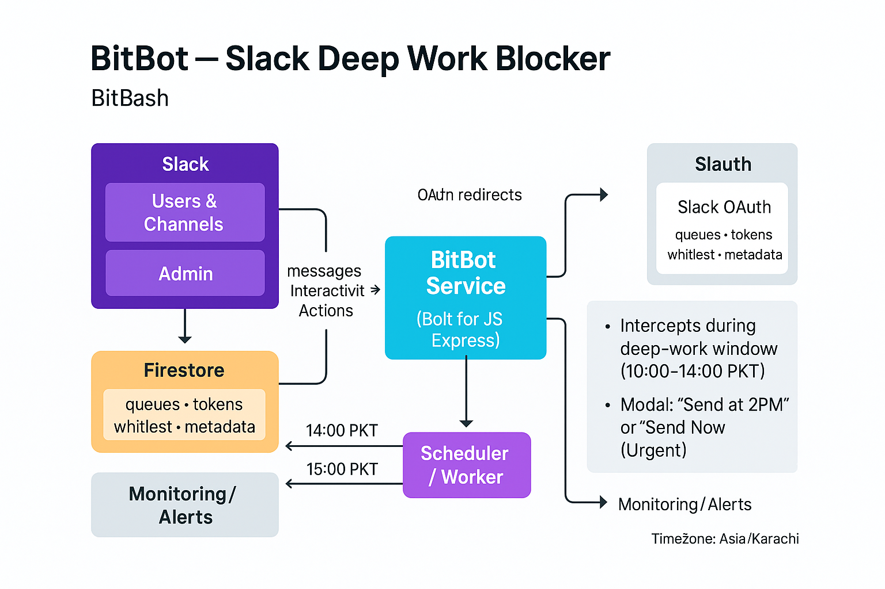
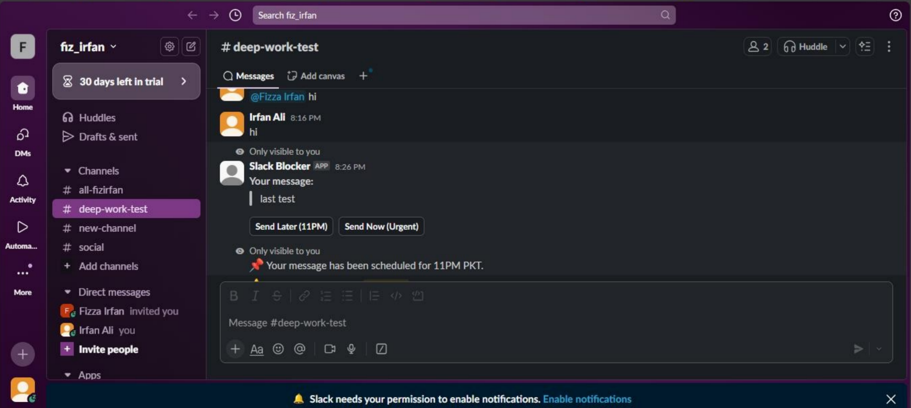
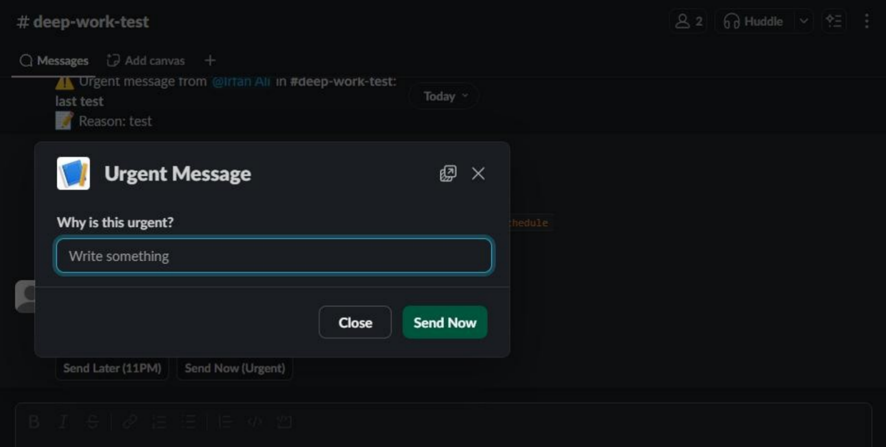
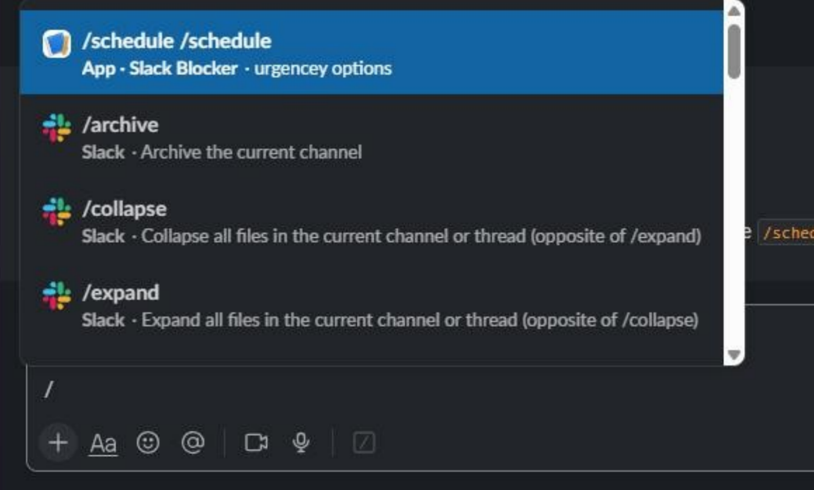
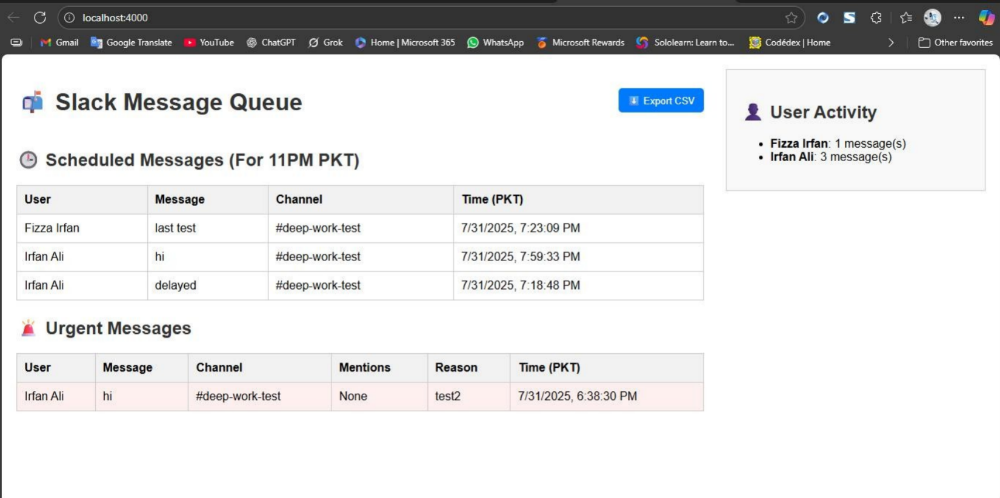
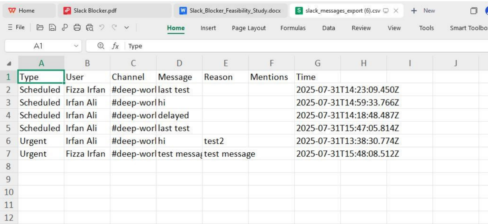

# BitBot — Slack Deep Work Blocker  

A BitBash product for distraction-free teams

  
  
  
  
  

> **BitBot** enforces “deep work” hours inside Slack (default: **10:00–14:00 PKT**). It nudges people to schedule non-urgent messages for later, allows justified urgent exceptions, and gives admins on/off and whitelist controls—while logging everything for visibility.

---

## Why BitBot
Most teams live in Slack. During deep-work windows, random pings kill focus. **BitBot** intercepts behavior and replaces it with intent: schedule for later or justify urgency—then reports what happened so teams can improve.

---

## Problem Statement (detailed)
Slack is fantastic for speed, but constant pings fragment attention. Managers push for “focus time,” yet the tools rarely enforce it. **BitBot** creates a predictable daily quiet window (default **10:00–14:00 PKT**) and changes the default behavior:
- **Non-urgent** → schedule for later (delivered automatically at 14:00).
- **Truly urgent** → allowed only with a required reason (logged).
- **Visibility** → daily summary reports help leaders spot patterns, overuse of “urgent,” and improvement areas.

This reduces interruptions, protects flow, and makes communication intentional without blocking work that genuinely can’t wait.

---

## What is “Deep Work”?
**Deep work** is uninterrupted, cognitively demanding work—designing, coding, writing, analysis—done without context switching. In BitBot:
- Deep-work window: **10:00–14:00 PKT** (configurable).
- During this window, BitBot nudges users to **Send at 2 PM** or **Send Now (Urgent)** with a reason.
- All decisions are logged (who, when, what type), enabling healthy norms and data-driven adjustments.

---

## Features
- **Deep-work enforcement** (configurable hours). Non-urgent messages are encouraged to be scheduled for post-block delivery.
- **Urgent override** with a required reason (tracked for accountability).
- **/schedule** command for DMs & channels, with clean modals.
- **Admin powers**
  - `/blocker on|off` to toggle globally
  - `/whitelist add|remove|list` to exempt key users (e.g., incident responders)
- **Auto-join & OAuth for DMs** so the bot can guide users privately without manual work.
- **Daily reporting** (summary of violations/urgent msgs) and exports (CSV/PDF).
- **Persistent logging** to Google Sheets + Firestore for analysis.

---

## How It Works (UX)
1. During deep-work hours, a user composes a message.  
2. BitBot privately prompts: **Send at 2 PM** (default) or **Send Now (Urgent)** → requires reason.  
3. If “Send at 2 PM,” BitBot queues the message and delivers it automatically at **14:00 PKT**. If “Urgent,” it posts immediately with the reason. Everything is logged.

> For DMs and MPIMs, the user authorizes once via OAuth; BitBot auto-joins new DMs and keeps tokens fresh.

---

---

## Admin Controls
- **/blocker on** → Start enforcing rules.  
  **/blocker off** → Pause enforcement (e.g., holidays, incidents).  
- **/whitelist add @user | remove @user | list** → Manage exemptions (stored in Firestore).  
> Only the workspace admin (matching `ADMIN_USER_ID`) can run these commands; others get a permission error.

---
# Scopes & Permissions

These are typical granular bot scopes; tailor as needed.

## Core (bot)
- `chat:write` — send messages (incl. scheduled)
- `commands` — enable slash commands
- `users:read` — basic user info for logs/messages
- `channels:read`, `groups:read`, `im:read`, `mpim:read` — list conversations for membership/join logic
- `channels:history`, `groups:history`, `im:history`, `mpim:history` — read messages where the bot is a member (for context/modals)

## Optional (when needed)
- `chat:write.customize` — post with custom username/icon
- `files:write` — if you export reports to Slack as files

### Notes
- Bots can **only delete their own messages**. Deleting other users’ messages is restricted; BitBot avoids deletion and uses modals/flows instead.
- Reading DMs requires the bot to be a member; for full DM/MPIM support, use OAuth to obtain appropriate access and auto-join where allowed.

---

# Data & Logging

## Google Sheets (quick audit)
- Columns: `timestamp`, `user`, `channel`, `type` (`scheduled`, `urgent`, `blocked`), `reason` (if urgent), `attempt_no`

## Firestore (system of record)
- `scheduled_messages` — payload, author, channel, `deliver_at`
- `urgent_messages` — payload, author, channel, `reason`, `sent_at`
- `whitelist_users` — user IDs exempt from block
- `user_oauth_tokens` — (if used) per-user tokens for DM support
- `runs/daily_summaries` — stats for reports/analytics

## Privacy
- Store only what you need. Mask PII where possible. Restrict access via roles/service accounts.

---

# Cron Jobs & Automation
- **14:00 PKT** — deliver all queued messages; clear queue
- **15:00 PKT** — post daily summary (counts, top reasons, repeat offenders)
- **Every 5m** — health checks (tokens, auto-join DMs, retry failed deliveries)
- **00:00 PKT** — discover new users; send onboarding/OAuth if required

*Adjust with your scheduler (e.g., Cloud Scheduler, cron, or a durable queue worker).*

---

# Limitations & Design Choices
- **No destructive controls:** Slack won’t let the bot delete others’ messages; we steer behavior rather than police it post-hoc.
- **Human-first UX:** A single modal with two choices beats complex policy docs users never read.
- **Lightweight storage:** Firestore + Sheets cover both durability and quick audits without heavy infra.
- **DM privacy:** DM visibility requires explicit access; we use OAuth and keep tokens securely.
- **Rate limits:** Slack APIs have limits; we batch and backoff for scheduled sends & summaries.

---

## Screenshots
> Place images in `docs/screenshots/`. These are the views referenced in the feasibility study.

1. **/schedule modal — choice & timing**  
   Show the modal offering **Send at 2PM** vs **Send Now (Urgent)** during the block.  
   `docs/screenshots/01-schedule-modal.png`  
   

2. **Urgent reason prompt**  
   Follow-up input for “Why is this urgent?” and the resulting urgent message (with reason).  
   `docs/screenshots/02-urgent-reason.png`  
   

3. **Queued message confirmation**  
   Confirmation after choosing **Send at 2PM**; message is queued for timed delivery.  
   `docs/screenshots/03-queued-confirmation.png`  
   
d
4. **Daily summary report in Slack**  
   Example summary (violations, urgent/scheduled totals) posted ~15:00 in a fixed channel.  
   `docs/screenshots/04-daily-summary.png`  
   

5. **Violation logs — Google Sheet**  
   Columns: username, type, time, attempt, reason (quick audits).  
   `docs/screenshots/07-google-sheet-logs.png`  
   

# Roadmap
- Workspace-level settings UI (hours, channels, timezone)
- Channel-specific rules (e.g., `#incidents` always exempt)
- Weekly trend reports (urgent justification categories)
- Advanced exports & admin dashboard (filters, cohorts)
- Multi-language prompts and localized times
- Fine-grained whitelists (by channel, by role)

---

# FAQ

**Does this work in DMs?**  
Yes. The bot needs to be present; for reliable DM support we add OAuth so users grant permission once.

**Can I bypass the block?**  
Ask an admin to add you to the whitelist or wait until the window ends.

**Will it delay truly urgent messages?**  
No — urgent messages are allowed immediately, but a reason is required and logged.

**Where are logs stored?**  
Quick audits in Google Sheets; full history in Firestore (see _Data & Logging_).

**What if our hours differ?**  
Change `DEEP_WORK_START_HOUR`, `DEEP_WORK_END_HOUR`, and `TIMEZONE` in your env.

---

# Contact Us:

  <a href="https://mail.google.com/mail/u/?authuser=ahmadzee26@gmail.com">
    
    <code>ahmadzee26@gmail.com</code>
  </a>
   ┃ 
  
  <a href="https://t.me/zeeshanahmad4">
    
    <code>@zeeshanahmad4</code>
  </a>
   ┃ 
  
  <a href="https://discord.com">
    
    <code>zee#2655</code>
  </a>
   ┃ 
  
  <a href="https://www.upwork.com/freelancers/zeeshanahmad291">
    
    <code>Zeeshan Ahmad</code>
  </a>

---

# License
Proprietary © BitBash. All rights reserved.  
(If you prefer open-source, swap to MIT/Apache-2.0 and add a `LICENSE` file.)

